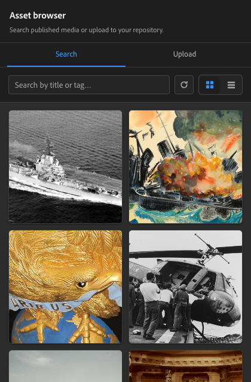
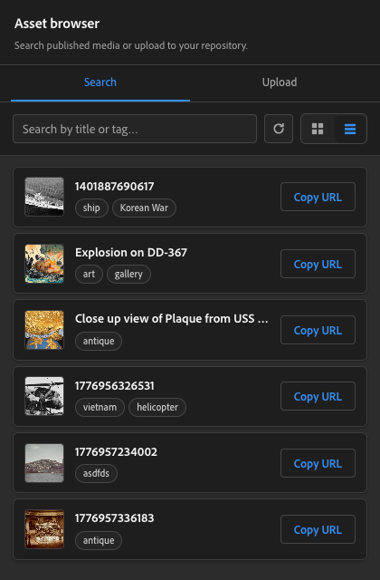
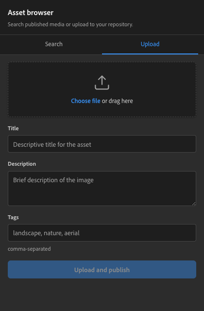
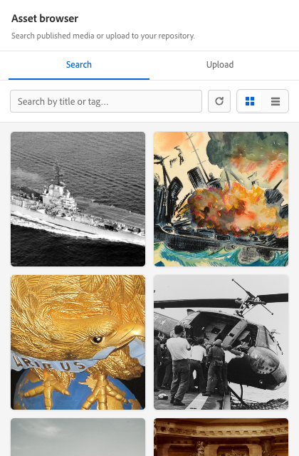
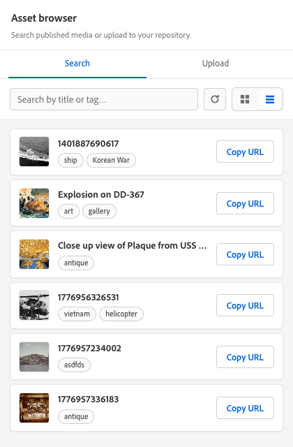
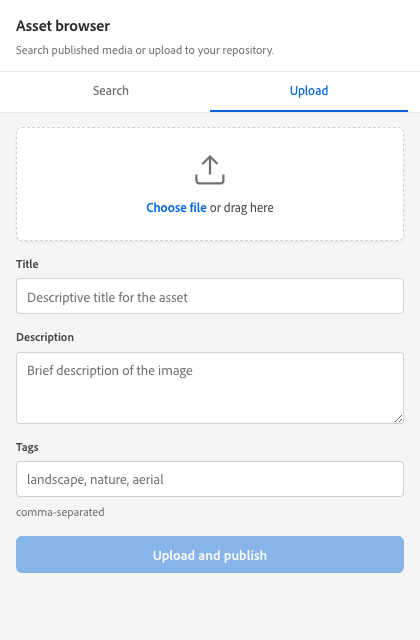
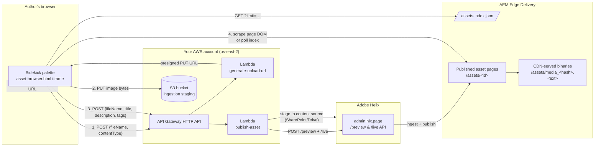

# Asset Browser — AEM Sidekick palette

A self-contained Sidekick palette that lets authors **search the published media library**
and **upload new images directly into the EDS content source** without leaving the page
they are editing. New uploads are pushed to S3, ingested into the AEM Helix content tree,
published, and indexed — and the canonical `media_<hash>` URL is copied to the clipboard
when ingestion finishes.

Single-file frontend (HTML + inline CSS + inline JS), zero build step — drop the file
under `/tools/sidekick/...` and it ships with the rest of your EDS code.

## Contents

| Path | Purpose |
| --- | --- |
| `tools/sidekick/asset-browser/asset-browser.html` | The palette itself. Pure HTML + CSS + JS, no dependencies. |
| `tools/sidekick/asset-browser/README.md` | This file. |
| `tools/sidekick/asset-browser/docs/` | Screenshots used in this README (light + dark, search + upload). |
| `tools/sidekick/config.json` | Where you register the palette so Sidekick shows it (entry not present by default — see [Sidekick registration](#sidekick-registration)). |

The palette has two tabs:

- **Search** — paginated, filterable view of `assets-index.json`. Each card has a Copy URL
  button and a row of clickable tag pills; clicking a pill seeds the search input.
- **Upload** — drop or pick an image, fill title / description / tags, click
  *Upload and publish*. Progress, an error box, and a result box with the canonical URL
  appear in-place.

```
┌───────────────────────────────────────┐
│  Asset browser                        │
│  Search published media or upload …  │
├───────────────────────────────────────┤
│  Search           |     Upload        │  ← tabs
├───────────────────────────────────────┤
│  [ search input.... ] [⟳]  [⊞]  [☰]  │  ← search bar + refresh + view toggle
├───────────────────────────────────────┤
│  ┌────────┐  ┌────────┐               │
│  │  img   │  │  img   │   …           │  ← grid (or list) of indexed assets
│  └────────┘  └────────┘               │
└───────────────────────────────────────┘
```

## Screenshots

Captured at the default Sidekick palette size (~420 × 640).

**Dark theme** (the Sidekick default):

| Search — grid | Search — list | Upload |
| :---: | :---: | :---: |
|  |  |  |

**Light theme** (`?theme=light` or system preference):

| Search — grid | Search — list | Upload |
| :---: | :---: | :---: |
|  |  |  |

Notes worth seeing in the shots above:

- The **search bar** packs three controls — search input, refresh (⟳) button, and grid/list view toggle — in one always-visible row at the top.
- **Tag pills** appear on every card in both views; clicking one seeds the search input and filters in place.
- The **dropzone** in the upload panel doubles as a click-target and drag-target; the button activates only after a file is chosen.

## End-to-end architecture



The key insight is that the asset-browser.html itself is **frontend-only**. All the heavy
lifting — uploading to S3, calling the Helix Admin API, writing the metadata back into
the content source — lives in the two Lambdas. The palette only knows about the two
HTTPS endpoints.

## Frontend configuration

Three constants at the top of the inline `<script>` in `asset-browser.html` need to point
at your environment:

```js
const API_UPLOAD_URL  = 'https://<api-id>.execute-api.<region>.amazonaws.com/prod/generate-upload-url';
const API_PUBLISH_URL = 'https://<api-id>.execute-api.<region>.amazonaws.com/prod/publish-asset';
const INDEX_URL       = 'https://main--<repo>--<owner>.aem.live/assets-index.json';
```

The current values point at `nhhc/jfoxx`'s setup in `us-east-2` — replace with your own
API Gateway and your own EDS host.

The `?theme=dark` query param applied by Sidekick is honored automatically; the palette
uses CSS custom properties so light/dark switch is free.

## AWS infrastructure

You need three pieces of AWS infrastructure:

1. An **S3 bucket** for receiving the upload (private; objects expire after a short TTL).
2. Two **Lambda functions** behind an **HTTP API Gateway**:
   - `generate-upload-url`
   - `publish-asset`
3. An **IAM role** for each Lambda with the minimum permissions listed below.

### S3 bucket

| Setting | Value |
| --- | --- |
| Region | Same as Lambdas (`us-east-2` in our example) |
| Public access | Fully blocked. The frontend only writes via presigned URLs. |
| Versioning | Optional; not required. |
| Lifecycle | Recommended: expire objects after 24h — by then they have been ingested. |
| CORS | `PUT` from your EDS origins. |

CORS rules (apply to the bucket):

```json
[
  {
    "AllowedOrigins": [
      "https://main--<repo>--<owner>.aem.page",
      "https://main--<repo>--<owner>.aem.live"
    ],
    "AllowedMethods": ["PUT"],
    "AllowedHeaders": ["Content-Type"],
    "ExposeHeaders": ["ETag"],
    "MaxAgeSeconds": 3000
  }
]
```

Add `http://localhost:3000` (and any feature-branch preview hosts) for local dev.

### API Gateway (HTTP API)

A single HTTP API with two routes:

| Method | Path | Integration |
| --- | --- | --- |
| `POST` | `/generate-upload-url` | Lambda — `generate-upload-url` |
| `POST` | `/publish-asset` | Lambda — `publish-asset` |

CORS configuration on the API:

| Setting | Value |
| --- | --- |
| Allow origins | `https://main--<repo>--<owner>.aem.page`, `https://main--<repo>--<owner>.aem.live`, `http://localhost:3000` |
| Allow methods | `POST`, `OPTIONS` |
| Allow headers | `Content-Type` |
| Allow credentials | `false` |
| Max age | `3000` |

Stage name `prod` is used in the example URLs; rename if you prefer.

### Lambda 1 — `generate-upload-url`

Returns an S3 presigned `PUT` URL the browser will upload to directly.

**Request**

```http
POST /generate-upload-url
Content-Type: application/json

{
  "fileName": "moonshot.jpg",
  "contentType": "image/jpeg"
}
```

**Response**

```json
{
  "uploadUrl":  "https://<bucket>.s3.<region>.amazonaws.com/uploads/<uuid>/moonshot.jpg?X-Amz-Algorithm=…",
  "fileName":   "moonshot.jpg",
  "contentType":"image/jpeg",
  "key":        "uploads/<uuid>/moonshot.jpg"
}
```

The frontend uses `uploadUrl` for the S3 PUT and re-passes `fileName`, `contentType`,
and (typically) `key` back to `publish-asset`.

**Implementation outline (Node.js / aws-sdk v3)**

```js
import { S3Client } from '@aws-sdk/client-s3';
import { PutObjectCommand } from '@aws-sdk/client-s3';
import { getSignedUrl } from '@aws-sdk/s3-request-presigner';
import { randomUUID } from 'node:crypto';

const s3 = new S3Client({ region: process.env.AWS_REGION });

export const handler = async (event) => {
  const { fileName, contentType } = JSON.parse(event.body || '{}');
  if (!fileName || !contentType) {
    return { statusCode: 400, body: JSON.stringify({ error: 'fileName and contentType are required' }) };
  }
  if (!/^image\/(jpeg|png|webp|gif|svg\+xml)$/.test(contentType)) {
    return { statusCode: 400, body: JSON.stringify({ error: 'unsupported content type' }) };
  }

  const key = `uploads/${randomUUID()}/${fileName}`;
  const uploadUrl = await getSignedUrl(
    s3,
    new PutObjectCommand({
      Bucket: process.env.UPLOAD_BUCKET,
      Key: key,
      ContentType: contentType,
    }),
    { expiresIn: 300 }, // 5 minutes
  );

  return {
    statusCode: 200,
    headers: { 'Content-Type': 'application/json' },
    body: JSON.stringify({ uploadUrl, fileName, contentType, key }),
  };
};
```

**Required environment variables**

| Var | Example | Notes |
| --- | --- | --- |
| `UPLOAD_BUCKET` | `nhhc-asset-uploads` | The bucket configured above. |

**IAM execution-role policy**

```json
{
  "Version": "2012-10-17",
  "Statement": [
    {
      "Effect": "Allow",
      "Action": ["s3:PutObject"],
      "Resource": "arn:aws:s3:::nhhc-asset-uploads/uploads/*"
    },
    {
      "Effect": "Allow",
      "Action": ["logs:CreateLogStream", "logs:PutLogEvents"],
      "Resource": "arn:aws:logs:*:*:log-group:/aws/lambda/generate-upload-url:*"
    }
  ]
}
```

### Lambda 2 — `publish-asset`

Takes the uploaded object out of the staging bucket, registers it as a published asset
in your AEM content source, and publishes the wrapping page so EDS exposes the canonical
`/assets/media_<hash>.<ext>` URL.

**Request**

```http
POST /publish-asset
Content-Type: application/json

{
  "fileName":    "moonshot.jpg",
  "contentType": "image/jpeg",
  "title":       "Apollo 11 Moonshot",
  "description": "Saturn V launch pad before Apollo 11 lift-off, July 1969.",
  "tags":        "apollo, moon, 1969",
  "key":         "uploads/<uuid>/moonshot.jpg"   // optional, see below
}
```

**Response**

```json
{
  "publishedPath": "/assets/1714158012345-jpg",
  "publishedUrl":  "https://main--<repo>--<owner>.aem.live/assets/1714158012345-jpg",
  "mediaUrl":      "https://main--<repo>--<owner>.aem.live/assets/media_<hash>.jpg"
}
```

The frontend tolerates a few response shapes. In priority order it looks for:

1. Any field whose value matches `https://*.aem.live/assets/media_<hash>...`
   anywhere in the response (handy if your Lambda already knows the hash).
2. `publishedPath` — the path of the wrapping page; the frontend will then
   *scrape that page* and *poll the index* until it can resolve the
   canonical media URL.
3. Falls back to the index match by `original-filename`.

So returning just `publishedPath` works; returning `mediaUrl` directly is faster.

**What this Lambda must do internally**

The exact mechanism depends on which content backend you use:

- **SharePoint / Microsoft Graph** — copy the staged S3 object into the `Documents/assets/` folder (or wherever your `helix-query.yaml` `include:` glob points). Write a sidecar Excel/Word document holding `title / description / tags`.
- **Google Drive** — same idea using the Drive API and a Google Doc / Sheet.

Then call the Helix Admin API to preview + publish the new file:

```
POST https://admin.hlx.page/preview/<owner>/<repo>/main/assets/<id>
POST https://admin.hlx.page/live/<owner>/<repo>/main/assets/<id>
```

These calls require an `Authorization: token <hlx-admin-token>` header. Generate the
token at <https://aem.live/docs/admin.html#section/Authentication> and store it as a
Lambda secret (see env vars below).

**Required environment variables**

| Var | Example | Notes |
| --- | --- | --- |
| `UPLOAD_BUCKET` | `nhhc-asset-uploads` | Same bucket as Lambda 1. |
| `HELIX_OWNER` | `jfoxx` | Your GitHub owner. |
| `HELIX_REPO` | `nhhc` | Your repo name. |
| `HELIX_REF` | `main` | Branch tracked by code sync. |
| `HELIX_ADMIN_TOKEN` | (secret) | Bearer token for `admin.hlx.page`. Store in AWS Secrets Manager and read at cold-start. |
| `CONTENT_SOURCE_TOKEN` | (secret) | Sharepoint / Drive OAuth token (or refresh token). |
| `CONTENT_SOURCE_ROOT` | `/Documents/assets` | Where ingested assets land in the content source. |

**IAM execution-role policy** (S3 read of staged uploads, plus secrets access):

```json
{
  "Version": "2012-10-17",
  "Statement": [
    {
      "Effect": "Allow",
      "Action": ["s3:GetObject", "s3:DeleteObject"],
      "Resource": "arn:aws:s3:::nhhc-asset-uploads/uploads/*"
    },
    {
      "Effect": "Allow",
      "Action": ["secretsmanager:GetSecretValue"],
      "Resource": "arn:aws:secretsmanager:*:*:secret:nhhc/helix-admin-*"
    },
    {
      "Effect": "Allow",
      "Action": ["logs:CreateLogStream", "logs:PutLogEvents"],
      "Resource": "arn:aws:logs:*:*:log-group:/aws/lambda/publish-asset:*"
    }
  ]
}
```

Add a VPC config / NAT routing only if you want outbound calls from a private subnet.
Otherwise the default Lambda runtime can reach `admin.hlx.page` and the SharePoint /
Drive APIs directly.

### Securing the API

The current setup has no authentication on the API Gateway endpoints — anyone who knows
the URL can request a presigned PUT and trigger a publish. For internal demo use this
is fine; for production add **at least one** of:

- A Lambda authorizer that validates a Sidekick session token (the IMS / Sidekick
  context exposes one to the iframe via `postMessage`).
- A signed-cookie scheme between the EDS origin and the API.
- AWS WAF rules restricting the API to your EDS hostnames + author IPs.

## AEM / EDS configuration

### `helix-query.yaml` — the assets index

Lives at the root of your **content source** (SharePoint / Google Drive), not in this
repo. The frontend reads `/assets-index.json` produced by it.

```yaml
indices:
  assets:
    include:
      - /assets/**
    target: /assets-index.json
    properties:
      path:
        select: head > link[rel="canonical"]
        value: attribute(el, 'href')
      title:
        select: head > meta[property="og:title"]
        value: attribute(el, 'content')
      description:
        select: head > meta[property="og:description"]
        value: attribute(el, 'content')
      image:
        select: head > meta[property="og:image"]
        value: attribute(el, 'content')
      tags:
        select: head > meta[property="article:tag"]
        values: attribute(el, 'content')   # plural -> joined list
```

Two notes:

- **`values:` (plural) for tags.** This causes Helix to return all matching elements
  as an array. The frontend handles both array and JSON-string-array shapes.
- **`original-filename`** is searched by the upload-resolution fallback. If your
  publish-asset Lambda writes that field into the asset metadata, expose it as a
  property here too.

### Sidekick registration

Add an entry to `tools/sidekick/config.json`:

```json
{
  "project": "<your-project>",
  "plugins": [
    {
      "id": "asset-browser",
      "title": "Assets",
      "url": "/tools/sidekick/asset-browser/asset-browser.html",
      "isPalette": true,
      "environments": ["edit", "preview", "dev", "live"],
      "paletteRect": "bottom:24px;right:24px;height:min(640px,80vh);width:min(420px,92vw);"
    }
  ]
}
```

Sidekick will auto-detect changes; reload the document for the entry to appear.

### Cache headers (recommended)

By default EDS sends `cache-control: max-age=7200, must-revalidate` for files under
`/tools/sidekick/`. That's 2 hours of browser cache, which means iterating on the
palette is painful — you change the file, but authors keep seeing the previous
version until a hard refresh.

Set a no-cache header for the path via the
[Custom HTTP Response Headers admin API](https://www.aem.live/docs/custom-headers):

```bash
curl -X POST 'https://admin.hlx.page/config/<owner>/sites/<repo>/headers.json' \
  -H 'Content-Type: application/json' \
  --cookie "$(grep auth_token ~/.hlx-token)" \
  -d '{"/tools/sidekick/**":[{"key":"cache-control","value":"no-cache"}]}'
```

`no-cache` does not mean "never cache" — it means "always revalidate before using the
cached copy." Performance is fine (304 responses are cheap) and you stop fighting
stale palette HTML.

## Local development

```bash
npm install -g @adobe/aem-cli
aem up --no-open --forward-browser-logs
```

Open `http://localhost:3000/tools/sidekick/asset-browser/asset-browser.html?theme=dark`
to iterate on the palette outside of Sidekick. Anything served from the dev server
hits your local working copy directly, so you see edits immediately.

For end-to-end testing with the real Sidekick palette you have to push to a feature
branch — Sidekick palette URLs always go through `aem.page` / `aem.live`, never
localhost.

## End-to-end upload flow

For reference, here is exactly what happens when an author uploads a file:

1. Author drops `moonshot.jpg` into the dropzone, fills title / description / tags,
   clicks **Upload and publish**.
2. `POST /generate-upload-url {fileName, contentType}` → Lambda 1 → `{uploadUrl, key, fileName, contentType}`.
3. `PUT <uploadUrl>` with raw file bytes → S3 stages the object under `uploads/<uuid>/`.
4. `POST /publish-asset {fileName, contentType, title, description, tags, key}`
   → Lambda 2 → ingests + publishes → `{publishedPath[, mediaUrl]}`.
5. The palette immediately shows a placeholder URL (`<live-origin>{publishedPath}`).
6. The palette then resolves the **canonical** `media_<hash>` URL by, in order:
   1. Scanning the publish-asset response for any matching URL.
   2. Fetching the published asset page (`/assets/<id>`, plus `.plain.html` variants)
      and reading `picture > source[srcset]`, `img[src]`, etc.
   3. Re-fetching `/assets-index.json?_=<ts>` (cache-busted) and matching by
      `publishedPath` or `original-filename`.

   It retries up to 8 times with a 1.5s delay because the EDS publish + indexer take a
   few seconds. Each retry updates the progress label so the author sees that
   resolution is in flight.
7. When the canonical URL appears, it replaces the placeholder in the result box.
   Author clicks **Copy URL** → it goes to clipboard.
8. The search panel index is reloaded with cache-busting so the new asset shows up
   in the next session immediately.

If resolution times out (e.g., EDS publish queue backed up), the palette shows a
non-blocking warning explaining that the asset *was* published and will appear in the
search panel once indexing catches up. The placeholder URL it shows in the meantime
is the path-style URL — fine for hyperlinks, but won't get the `media_<hash>`
optimization until EDS finishes processing.

## Troubleshooting

| Symptom | Likely cause | Fix |
| --- | --- | --- |
| Palette shows old layout / missing features after editing | Browser-cached HTML (default 2h `max-age`) | Right-click in palette → **Reload Frame**, or set `cache-control: no-cache` on `/tools/sidekick/**` (see above). |
| Search panel shows `tags: "0"` for every asset | `helix-query.yaml` missing the `tags` property, or using `value:` (singular) where there are multiple matches | Switch to `values:` per the snippet above. |
| Tags render as `["a","b"]` literal text | UI hadn't been updated to parse the JSON-string array shape Helix produces | Already handled by `parseTagsValue()`. If you see this, you're on an old build of the palette. |
| Copy URL returns the path, not `/assets/media_<hash>.jpg` | Canonical resolution timed out — EDS hadn't finished publishing yet | Wait a few seconds and click the **⟳ refresh** button at the top of the search panel, then copy from there. |
| Upload succeeds but no row appears in the index | Indexer hasn't run yet, or `helix-query.yaml` `include:` glob doesn't match the actual published path | Check `https://admin.hlx.page/status/<owner>/<repo>/main/<publishedPath>`. Confirm the path is matched by `include:` in `helix-query.yaml`. |
| `CORS` error on the `PUT` to S3 | Bucket CORS missing your origin | Add the EDS origin to the bucket CORS configuration. |
| `CORS` error on the `POST` to API Gateway | API Gateway CORS missing your origin | Add the EDS origin to the API Gateway CORS configuration. |
| 401 / 403 from `publish-asset` Lambda | `HELIX_ADMIN_TOKEN` expired or scoped wrong | Re-issue the admin token at <https://aem.live/docs/admin.html#section/Authentication> and update the secret. |

## Why this design

A few of the explicit choices, each driven by a concrete failure mode hit during
development:

- **Direct S3 PUT instead of a multipart upload through Lambda.** Lambda payload
  limits cap requests at 6 MB sync / 256 KB through API Gateway (HTTP API), and
  binary handling adds base64 overhead. A presigned URL streams the upload straight
  to S3 from the browser.
- **Two Lambdas, not one.** The presign step is cheap and called every time the
  author picks a file (so we can validate filename / type early). The publish step
  is heavy and only runs after a confirmed upload.
- **DOM scrape + index polling for the canonical URL.** The publish-asset Lambda
  doesn't always know the final `media_<hash>` URL — that's allocated by EDS during
  ingestion. Scraping the published page reliably finds it; polling the index is a
  belt-and-suspenders fallback.
- **Refresh button in the search bar, not at the bottom.** Some Sidekick palette
  hosts compute iframe heights in a way that clips the bottom of the document.
  Anchoring the action to the always-visible top row sidesteps that entire class of
  bug. (See the commit history for the painful version of this discovery.)
- **`?_=<ts>&cache: 'no-store'` on the refresh action.** Combination of HTTP-cache
  bust and CDN cache key bypass — neither alone is reliable for both the browser and
  Fastly.
